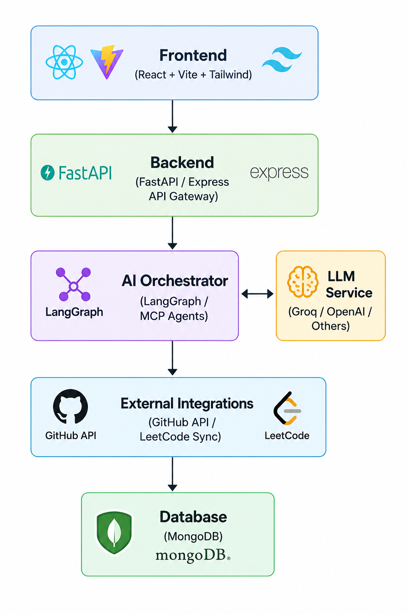
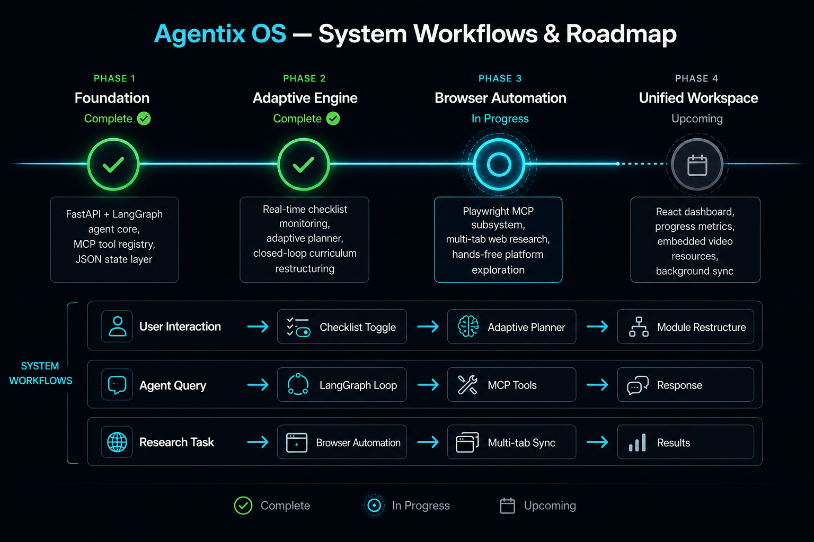

# Agentix OS ⚡

An autonomous, agentic learning ecosystem that transforms a dark-mode developer workspace into an automated, contextual study assistant. Powered by a proactive feedback loop and live browser automation, Agentix orchestrates real-time curriculum adjustment and hands-free platform research.

## 🗺️ System Architecture & Roadmap

### Project Architecture


### System Workflows


---

## 🚀 Core Features

### 📊 1. Dashboard
Centralized control center displaying system metrics, recent workspace activity, node status, and quick-action shortcuts across all tools.

### 🤖 2. AI Chat & Persona Engine
Multi-turn conversational AI workspace powered by specialized agent personas:
- **Dynamic Agent Personas:** Toggle between specialized modes including *General Chat*, *Build Roadmap*, *Honest Reviewer*, and *Hackathon Partner*.
- **Code & Repository Context:** Inspect code snippets, analyze full repository structures, and debug technical queries in real-time.
- **Structured JSON Workflows:** Validated schema outputs ensuring seamless UI rendering and state synchronization.

### 🗺️ 3. Roadmaps & AI Generation
Interactive learning path generator designed for structured interview and technical preparation:
- Generates step-by-step study plans (e.g., *30-Day Dynamic Programming*, *System Design for Beginners*, *FAANG Interview Preparation*).
- Breaks complex topics into structured weekly and daily execution milestones.
- Saves progress directly to your workspace for real-time tracking.

### 📄 4. ATS Scanner & Resume Optimizer
Candidate metric analysis and machine-readability scoring powered by hybrid keyword and layout calculators:
- **ATS Scanner:** Parses PDF/TXT resumes, evaluates keyword alignment against target job descriptions, and computes instant compatibility scores.
- **Impact Bullet Point Generator:** Analyzes connected repositories to craft high-impact, metric-driven resume bullet points highlighting technical execution.

### 📝 5. Notes Workspace
Persistent note-taking hub for capturing technical ideas, study logs, code snippets, and interview prep thoughts—backed by MongoDB storage.

### 🔌 6. Integrations (GitHub & LeetCode)
Direct platform connections to unify developer workflows:
- **GitHub Integration:** Fetches repository structures, file contents, and execution metrics via GitHub APIs.
- **LeetCode Sync:** Tracks algorithm problem-solving progress and correlates practice data with AI study recommendations.

---
## Tech Stack

### **Frontend**
- React
- TypeScript
- Vite
- Tailwind CSS

### **Backend & AI Core**
- Python (FastAPI) / Node.js Express
- LangGraph / MCP Architecture
- MongoDB (Mongoose / PyMongo)

### **Integrations & Auth**
- GitHub REST / GraphQL API
- LeetCode Data Sync
- OAuth 2.0 Authentication
---

## Planned Features

### 🛡️ Multi-Agent Code Review Pipeline
Expand autonomous sub-agents (Bug Agent, Security Agent, Performance Agent) for parallel pull-request reviews.

### 📊 Real-Time Mock Interview Agent
Interactive technical mock interviews with real-time feedback on system design and coding efficiency.


## ⚙️ Installation & Setup

### 1. Backend Environment Setup
```bash
# Activate your virtual environment
source venv/bin/activate

# Install core dependencies
python3 -m pip install playwright
python3 -m playwright install
```

### 2. Frontend Interface Setup
```bash
# Install node dependencies
npm install

# Boot the local development instance
npm run dev
```
The interface will initialize locally at http://localhost:5173.
